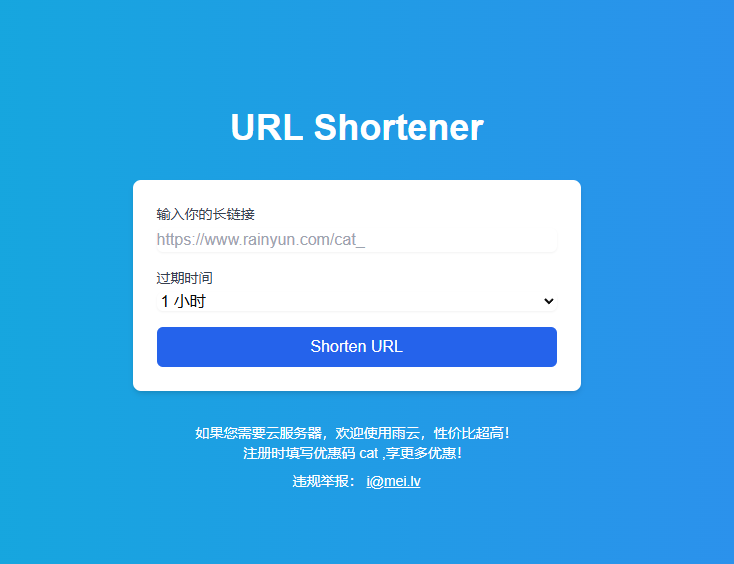
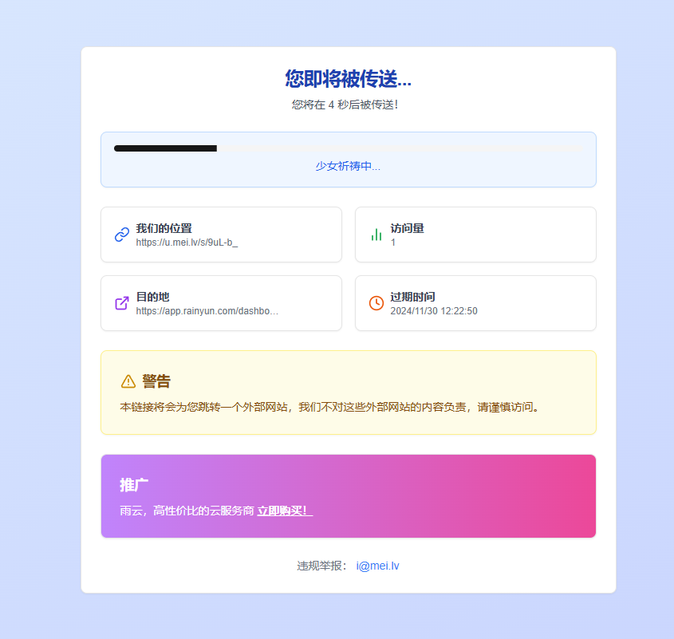

<h1 align="center">URL-Shortener</h1>
<strong>URL-Shortener 是一个基于 Next.js 的简易短链接应用</strong>
<br>




</div>

### 部署

支持部署环境：

- Docker
- Systemd

```shell
mkdir url-shortener
cd url-shortener
touch .env ## 参考 .env.example 填写
wget https://git.mei.lv/mei/short-url/raw/branch/main/docker-compose.yaml
docker compose up -d
```

部署成功后,服务会在 `8567` 端口上启动

### 迁移

替换 `data/` 目录下的 `shorturl.db` 文件即可

### 开发

```shell
mkdir data
```
